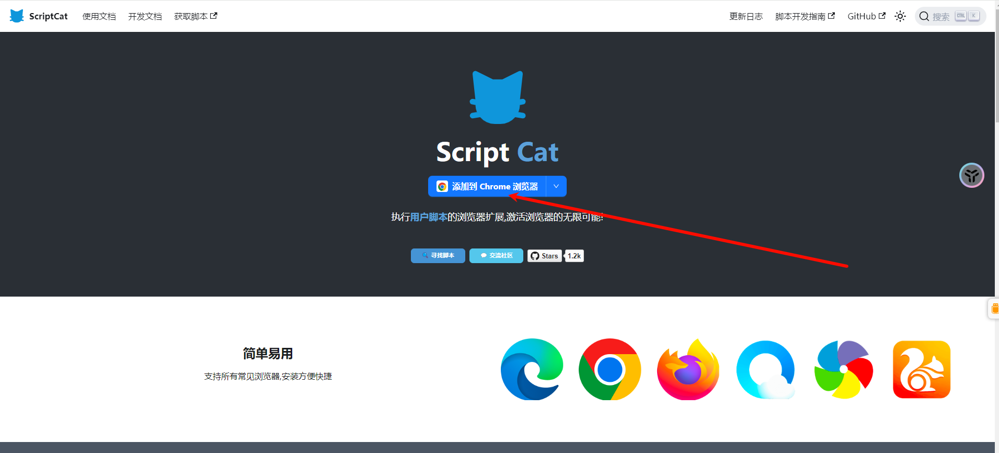
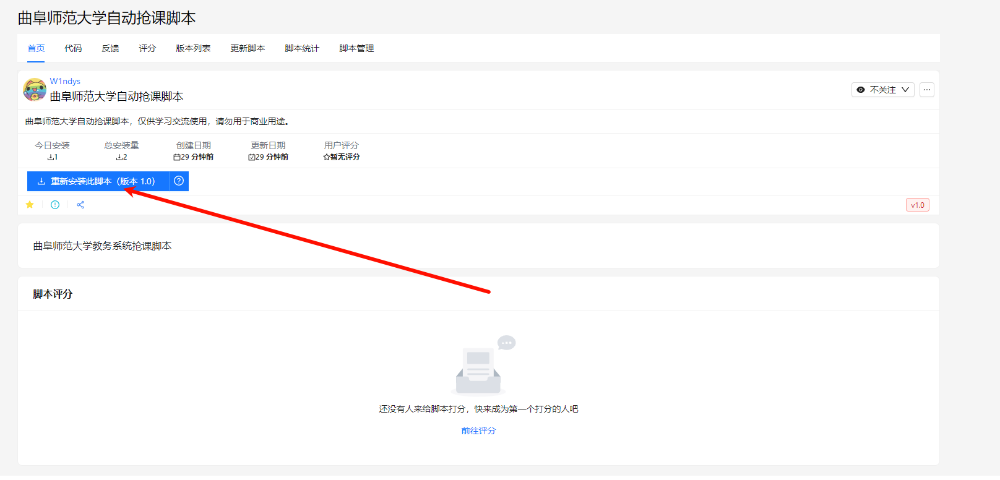
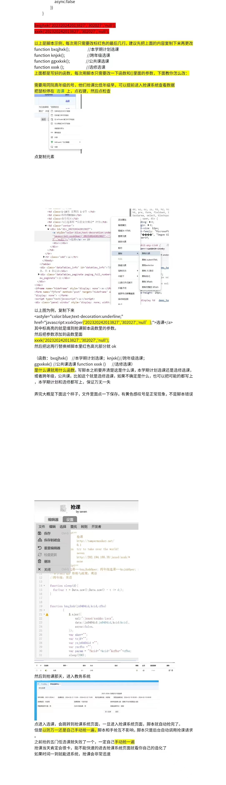

# Qufu-Auto-Course-Selector

曲阜师范大学抢课脚本

## 如何使用

1. 安装脚本猫

   进入链接安装脚本猫 https://docs.scriptcat.org/#/

   

   根据你自己的浏览器安装即可

   > 注意：Chrome 需要科学上网加速才能安装，Edge 浏览器不需要

2. 安装脚本

   点击下面链接安装脚本

   https://scriptcat.org/zh-CN/script-show-page/1934/

   

3. 配置脚本

   打开脚本猫，点击脚本管理器，选择脚本源码

4. 其余教程暂未编写，请等待作者······

   其余方法可以暂时看下图下面的`红色黄色部分`

   
